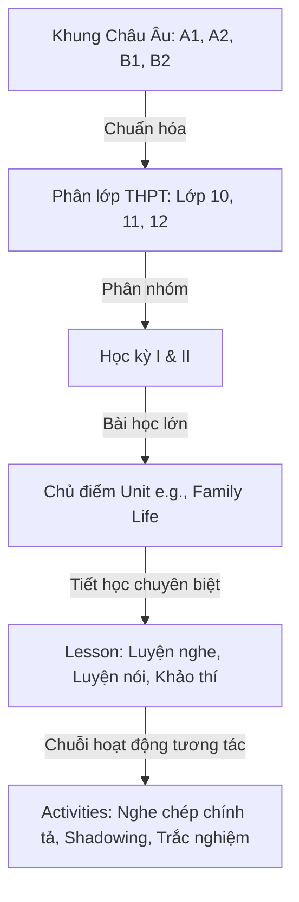
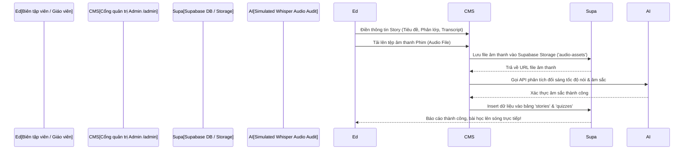

# 🎬 KIẾN TRÚC VẬN HÀNH & NỘI DUNG SỐ (CONTENT & CMS OPERATIONS)
*Phase B — Immersive Content Relationship & internal CMS Engine*

> [!IMPORTANT]
> Tài liệu này được thiết lập bởi CTO & Product Lead của Cinematic English, quy chuẩn hóa mối quan hệ liên kết giáo trình quốc gia (Global Success / GD&ĐT) với hệ sinh thái điện ảnh và quy trình vận hành CMS phân phối học liệu tự động.

---

## 🏛️ 1. MÔ HÌNH QUAN HỆ HỌC LIỆU CAO CẤP (CONTENT RELATIONSHIP MODEL)

Hệ thống Cinematic English tích hợp giáo trình Tiếng Anh phổ thông (Lớp 10, 11, 12) của Bộ Giáo dục & Đào tạo Việt Nam với Khung tham chiếu năng lực ngôn ngữ chung Châu Âu (CEFR).



### Quản lý Mối quan hệ trong Cơ sở dữ liệu:
- **CEFR Alignment**: Mỗi bài học lớn (`Unit`) được phân lớp dựa trên chuẩn đầu ra quốc gia:
  - **Lớp 10**: Tiêu chuẩn đầu ra CEFR A2+ đến B1.
  - **Lớp 11**: Tiêu chuẩn đầu ra CEFR B1.
  - **Lớp 12**: Tiêu chuẩn đầu ra CEFR B1+ đến B2 (chuẩn bị thi THPT Quốc gia & IELTS).
- **Lesson Chain**: Các bài học được sắp xếp theo trình tự tăng dần độ khó (Scaffolding). Học sinh bắt đầu bằng bài học **Khởi động** (Getting Started), tiếp tục qua các bài **Luyện nghe sâu** (Listening), **Luyện nói tự nhiên** (Speaking/Shadowing) và kết thúc bằng **Bài kiểm tra** (Exam) tổng hợp.

---

## 🛠️ 2. CHƯƠNG TRÌNH CMS QUẢN TRỊ NỘI BỘ (INTERNAL CMS ARCHITECTURE)

Giao diện quản trị viên dành cho giáo viên và biên tập viên nội dung (`/admin`) được thiết kế tối giản, loại bỏ hoàn toàn các tương tác giả để tạo bài học thật chỉ trong vài cú click:



---

## 📐 3. BẢNG DỮ LIỆU NỘI DUNG CHI TIẾT (CONTENT SCHEMAS)

### Bảng Giáo trình môn học (`grades`, `semesters`, `units`)
```sql
CREATE TABLE public.grades (
    id UUID PRIMARY KEY DEFAULT gen_random_uuid(),
    title VARCHAR(255) NOT NULL, -- 'Lớp 10', 'Lớp 11', 'Lớp 12'
    description TEXT,
    order_index INTEGER NOT NULL,
    created_at TIMESTAMP WITH TIME ZONE DEFAULT CURRENT_TIMESTAMP
);

CREATE TABLE public.semesters (
    id UUID PRIMARY KEY DEFAULT gen_random_uuid(),
    grade_id UUID REFERENCES public.grades(id) ON DELETE CASCADE,
    title VARCHAR(255) NOT NULL, -- 'Học kỳ I', 'Học kỳ II'
    order_index INTEGER NOT NULL
);

CREATE TABLE public.units (
    id UUID PRIMARY KEY DEFAULT gen_random_uuid(),
    semester_id UUID REFERENCES public.semesters(id) ON DELETE CASCADE,
    title VARCHAR(255) NOT NULL, -- 'Unit 1: Family Life'
    description TEXT,
    cover_url TEXT,
    order_index INTEGER NOT NULL
);
```

### Bảng Tiết học & Hoạt động (`lessons`, `activities`)
```sql
CREATE TABLE public.lessons (
    id UUID PRIMARY KEY DEFAULT gen_random_uuid(),
    unit_id UUID REFERENCES public.units(id) ON DELETE CASCADE,
    title VARCHAR(255) NOT NULL, -- 'Speaking - Family Responsibilities'
    type VARCHAR(50) NOT NULL CHECK (type IN ('Listening', 'Speaking', 'Reading', 'Writing', 'Language', 'Getting Started', 'Exam')),
    order_index INTEGER NOT NULL
);

CREATE TABLE public.activities (
    id UUID PRIMARY KEY DEFAULT gen_random_uuid(),
    lesson_id UUID REFERENCES public.lessons(id) ON DELETE CASCADE,
    title VARCHAR(255) NOT NULL,
    type VARCHAR(50) NOT NULL CHECK (type IN ('multiple_choice', 'fill_blanks', 'shadowing', 'dictation', 'matching')),
    instructions TEXT,
    content JSONB NOT NULL, -- Lưu trữ câu hỏi, đáp án, transcript mẫu, audioUrl của phim
    order_index INTEGER NOT NULL
);
CREATE INDEX idx_activities_lesson ON public.activities(lesson_id);
```

---

## 📥 4. LUỒNG NHẬP DỮ LIỆU LỚN TỰ ĐỘNG (BULK IMPORT MECHANISM)

Biên tập viên có thể tải lên toàn bộ 12 Unit học của một khối lớp thông qua một tệp JSON tiêu chuẩn duy nhất tại cổng CMS, thay vì nhập thủ công từng hoạt động:

### File JSON mẫu nhập liệu (`bulk_curriculum_import.json`)
```json
{
  "grade": "Lớp 12",
  "semester": "Học kỳ I",
  "unit": {
    "title": "Unit 1: Life Stories",
    "description": "Tìm hiểu và thảo luận về cuộc đời, sự nghiệp của các danh nhân lịch sử.",
    "order_index": 1,
    "lessons": [
      {
        "title": "Luyện nghe: Steve Jobs Commencement Speech",
        "type": "Listening",
        "order_index": 1,
        "activities": [
          {
            "title": "Nghe chép chính tả Steve Jobs",
            "type": "dictation",
            "instructions": "Lắng nghe đoạn phát biểu nổi tiếng của Steve Jobs tại Stanford và điền từ còn thiếu vào ô trống.",
            "order_index": 1,
            "content": {
              "audioUrl": "https://pub-storage.cinematicenglish.vn/audio/steve_jobs_stanford.mp3",
              "transcript": "Your time is limited so dont waste it living someone elses life."
            }
          }
        ]
      }
    ]
  }
}
```

### API Handler xử lý nhập liệu lớn (`/api/admin/bulk-import/route.ts`)
```typescript
import { createRouteHandlerClient } from '@supabase/auth-helpers-nextjs';
import { cookies } from 'next/headers';
import { NextResponse } from 'next/server';

export async function POST(req: Request) {
  const supabase = createRouteHandlerClient({ cookies });
  
  // 1. Xác thực quyền Admin
  const { data: { session } } = await supabase.auth.getSession();
  if (!session) return NextResponse.json({ error: "Chưa đăng nhập" }, { status: 401 });
  
  const { data: profile } = await supabase
    .from('profiles')
    .select('role')
    .eq('id', session.user.id)
    .single();
    
  if (profile?.role !== 'admin') {
    return NextResponse.json({ error: "Không có quyền quản trị" }, { status: 403 });
  }

  try {
    const body = await req.json();
    const { grade, semester, unit } = body;
    
    // 2. Chèn dữ liệu theo cấu trúc hình cây lồng nhau
    // - Tìm hoặc chèn Grade
    let { data: dbGrade } = await supabase.from('grades').select('id').eq('title', grade).single();
    if (!dbGrade) {
      const { data: newGrade } = await supabase.from('grades').insert({ title: grade, order_index: 12 }).select('id').single();
      dbGrade = newGrade;
    }
    
    // - Tìm hoặc chèn Semester
    let { data: dbSemester } = await supabase.from('semesters').select('id').eq('title', semester).eq('grade_id', dbGrade?.id).single();
    if (!dbSemester) {
      const { data: newSem } = await supabase.from('semesters').insert({ grade_id: dbGrade?.id, title: semester, order_index: 1 }).select('id').single();
      dbSemester = newSem;
    }
    
    // - Chèn Unit
    const { data: dbUnit } = await supabase.from('units').insert({
      semester_id: dbSemester?.id,
      title: unit.title,
      description: unit.description,
      order_index: unit.order_index
    }).select('id').single();
    
    // - Chèn Lessons & Activities theo vòng lặp transaction
    for (const lesson of unit.lessons) {
      const { data: dbLesson } = await supabase.from('lessons').insert({
        unit_id: dbUnit?.id,
        title: lesson.title,
        type: lesson.type,
        order_index: lesson.order_index
      }).select('id').single();
      
      for (const act of lesson.activities) {
        await supabase.from('activities').insert({
          lesson_id: dbLesson?.id,
          title: act.title,
          type: act.type,
          instructions: act.instructions,
          content: act.content,
          order_index: act.order_index
        });
      }
    }
    
    return NextResponse.json({ success: true, message: "Nhập liệu toàn bộ giáo trình thành công!" });
  } catch (error: any) {
    return NextResponse.json({ error: error.message }, { status: 500 });
  }
}
```

---

## 🛠️ 5. LỘ TRÌNH ĐỒNG BỘ DỮ LIỆU (CONTENT DEPLOYMENT PLAN)

1. **Khởi chạy Hệ thống lưu trữ (Asset Storage)**: Thiết lập Supabase Bucket `'lessons-media'` công khai với các thư mục phân cấp `/audio` và `/thumbnails` nhằm lưu trữ tài nguyên bài học ổn định.
2. **Khai thác Giáo trình Mẫu**: Lập dữ liệu JSON mẫu của Unit 1 & Unit 2 cho cả 3 khối lớp (10, 11, 12) bám sát sách giáo khoa Global Success.
3. **Thực thi Bulk-Import ban đầu**: Khởi chạy API `/api/admin/bulk-import` để đưa toàn bộ bài học lên máy chủ ngay trong đợt triển khai Beta đầu tiên.
4. **Cô lập Môi trường**: Giữ tài liệu audio/thumbnail trên hệ thống CDN ổn định (như Cloudflare hoặc BunnyCDN) nhằm giảm băng thông tải trực tiếp từ máy chủ Supabase khi người dùng học bài tăng mạnh.
