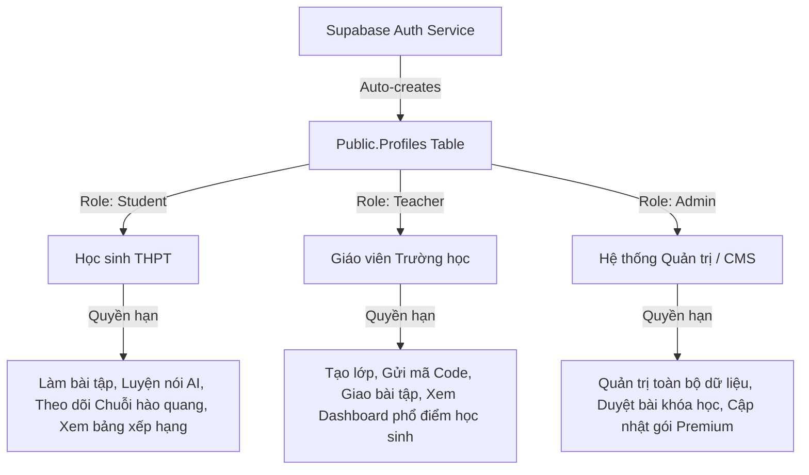
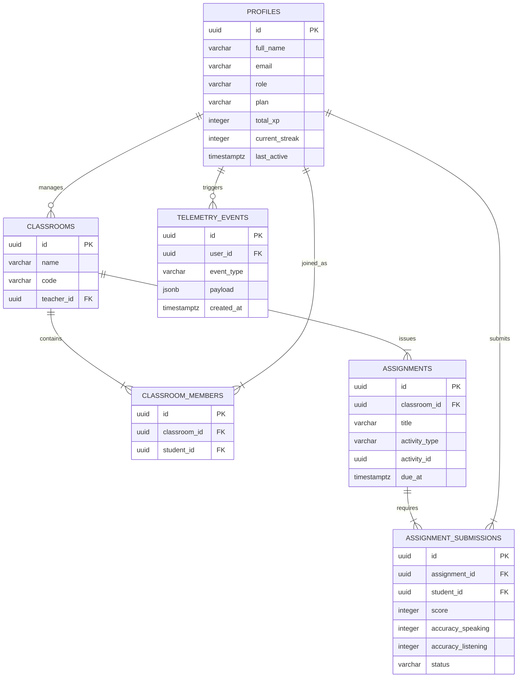

# 🗄️ KIẾN TRÚC CƠ SỞ DỮ LIỆU & XÁC THỰC (DATABASE & AUTH ARCHITECTURE)
*Phase A — Production-grade Database Schema & Supabase Auth*

> [!IMPORTANT]
> Tài liệu này được thiết lập bởi CTO & Principal Architect của Cinematic English, quy định cấu trúc tổ chức dữ liệu chuẩn hóa, chính sách bảo mật cấp dòng (Row Level Security - RLS), mô hình phân quyền vai trò (Role-Based Access Control - RBAC) và luồng xác thực thực tế cho 100k+ người dùng.

---

## 👥 1. THIẾT KẾ PHÂN QUYỀN VAI TRÒ (RBAC DESIGN)

Hệ thống hỗ trợ 3 nhóm đối tượng người dùng chính với quyền hạn phân cấp rõ rệt:



### Chính sách và cơ chế phân quyền (Role Mechanisms)
- **Supabase Auth Hook**: Khi người dùng đăng ký tài khoản (Sign Up) qua email hoặc phương thức mời mã lớp, Supabase trigger `on_auth_user_created` tự động khởi tạo bản ghi trong bảng `public.profiles` với vai trò mặc định là `user` (Student).
- **Phân quyền Giáo viên**: Giáo viên đăng ký thông qua cổng riêng `/teacher` hoặc được trường học phê duyệt sẽ được chuyển vai trò thành `teacher`.
- **Phân quyền Quản trị (Admin)**: Vai trò `admin` được gán trực tiếp thông qua cơ sở dữ liệu để bảo mật tuyệt đối, ngăn chặn việc khai thác lỗ hổng đầu cuối.

---

## 🛡️ 2. BẢO MẬT & ROUTING TRONG NEXT.JS (SECURITY & MIDDLEWARE)

### Middleware Bảo vệ Routes (`middleware.ts`)
Next.js Middleware kiểm tra JWT session của Supabase Auth ở mỗi request. Nếu phiên hết hạn hoặc không hợp lệ, người dùng lập tức bị điều hướng về `/login`.

```typescript
// middleware.ts - Trích xuất giải pháp phân quyền thực tế
import { createMiddlewareClient } from '@supabase/auth-helpers-nextjs';
import { NextResponse } from 'next/server';
import type { NextRequest } from 'next/server';

export async function middleware(req: NextRequest) {
  const res = NextResponse.next();
  const supabase = createMiddlewareClient({ req, res });
  const { data: { session } } = await supabase.auth.getSession();

  const url = req.nextUrl.clone();
  
  // 1. Kiểm tra xác thực chung cho các vùng bảo vệ
  if (!session && url.pathname.startsWith('/dashboard')) {
    url.pathname = '/login';
    return NextResponse.redirect(url);
  }

  // 2. Kiểm tra vai trò đặc thù của Giáo viên (Teacher)
  if (session && url.pathname.startsWith('/teacher')) {
    const { data: profile } = await supabase
      .from('profiles')
      .select('role')
      .eq('id', session.user.id)
      .single();

    if (profile?.role !== 'teacher' && profile?.role !== 'admin') {
      url.pathname = '/dashboard'; // Học sinh truy cập trái phép bị đá về dashboard
      return NextResponse.redirect(url);
    }
  }

  // 3. Kiểm tra vai trò Quản trị viên (Admin)
  if (session && url.pathname.startsWith('/admin')) {
    const { data: profile } = await supabase
      .from('profiles')
      .select('role')
      .eq('id', session.user.id)
      .single();

    if (profile?.role !== 'admin') {
      url.pathname = '/dashboard';
      return NextResponse.redirect(url);
    }
  }

  return res;
}
```

---

## 📐 3. THIẾT KẾ SCHEMA CƠ SỞ DỮ LIỆU CHUẨN PRODUCTION (SCHEMA SPECIFICATIONS)

Dưới đây là các định nghĩa bảng SQL chuẩn hóa được tinh chỉnh để phục vụ dữ liệu thật, tối ưu hóa hiệu năng index:

### Bảng Người dùng & Hồ sơ (`profiles`)
Bảng này liên kết trực tiếp với bảng `auth.users` của Supabase Auth nhưng lưu trữ thông tin công khai nhằm tối ưu hóa RLS.
```sql
CREATE TABLE public.profiles (
    id UUID REFERENCES auth.users(id) ON DELETE CASCADE PRIMARY KEY,
    full_name VARCHAR(255) NOT NULL,
    email VARCHAR(255) UNIQUE NOT NULL,
    avatar_url TEXT,
    role VARCHAR(50) DEFAULT 'user' CHECK (role IN ('user', 'teacher', 'admin')),
    plan VARCHAR(50) DEFAULT 'Free' CHECK (plan IN ('Free', 'Pro', 'Group')),
    total_xp INTEGER DEFAULT 0,
    current_streak INTEGER DEFAULT 0,
    last_active TIMESTAMP WITH TIME ZONE DEFAULT CURRENT_TIMESTAMP,
    created_at TIMESTAMP WITH TIME ZONE DEFAULT CURRENT_TIMESTAMP
);
CREATE INDEX idx_profiles_role ON public.profiles(role);
CREATE INDEX idx_profiles_streak ON public.profiles(current_streak DESC);
```

### Bảng Lớp học & Thành viên (`classrooms`, `classroom_members`)
Hỗ trợ quản lý lớp học thực tế của các trường THPT tại Việt Nam thông qua mã Code 6 chữ số độc bản.
```sql
CREATE TABLE public.classrooms (
    id UUID PRIMARY KEY DEFAULT gen_random_uuid(),
    name VARCHAR(255) NOT NULL,
    code VARCHAR(6) UNIQUE NOT NULL, -- Mã code ngẫu nhiên e.g., 'A8F9G2'
    teacher_id UUID REFERENCES public.profiles(id) ON DELETE CASCADE,
    created_at TIMESTAMP WITH TIME ZONE DEFAULT CURRENT_TIMESTAMP
);
CREATE INDEX idx_classrooms_code ON public.classrooms(code);

CREATE TABLE public.classroom_members (
    id UUID PRIMARY KEY DEFAULT gen_random_uuid(),
    classroom_id UUID REFERENCES public.classrooms(id) ON DELETE CASCADE,
    student_id UUID REFERENCES public.profiles(id) ON DELETE CASCADE,
    joined_at TIMESTAMP WITH TIME ZONE DEFAULT CURRENT_TIMESTAMP,
    UNIQUE(classroom_id, student_id)
);
```

### Bảng Bài tập & Bài nộp (`assignments`, `assignment_submissions`)
Cho phép giáo viên giao bài luyện đọc, luyện nghe, hoặc làm bài kiểm tra cho học sinh và nhận về điểm số phân tích tự động.
```sql
CREATE TABLE public.assignments (
    id UUID PRIMARY KEY DEFAULT gen_random_uuid(),
    classroom_id UUID REFERENCES public.classrooms(id) ON DELETE CASCADE,
    title VARCHAR(255) NOT NULL,
    description TEXT,
    activity_type VARCHAR(50) NOT NULL CHECK (activity_type IN ('lesson', 'exam')),
    activity_id UUID NOT NULL, -- Tham chiếu tới lessons hoặc exams
    due_at TIMESTAMP WITH TIME ZONE NOT NULL,
    created_at TIMESTAMP WITH TIME ZONE DEFAULT CURRENT_TIMESTAMP
);

CREATE TABLE public.assignment_submissions (
    id UUID PRIMARY KEY DEFAULT gen_random_uuid(),
    assignment_id UUID REFERENCES public.assignments(id) ON DELETE CASCADE,
    student_id UUID REFERENCES public.profiles(id) ON DELETE CASCADE,
    score INTEGER DEFAULT 0,
    accuracy_speaking INTEGER DEFAULT 0,
    accuracy_listening INTEGER DEFAULT 0,
    status VARCHAR(50) DEFAULT 'submitted' CHECK (status IN ('submitted', 'graded')),
    completed_at TIMESTAMP WITH TIME ZONE DEFAULT CURRENT_TIMESTAMP,
    UNIQUE(assignment_id, student_id)
);
```

### Bảng Hệ thống Luyện tập & Thống kê (`user_progress`, `skill_breakdowns`)
```sql
CREATE TABLE public.user_progress (
    id UUID PRIMARY KEY DEFAULT gen_random_uuid(),
    user_id UUID REFERENCES public.profiles(id) ON DELETE CASCADE,
    story_id UUID NOT NULL,
    completed BOOLEAN DEFAULT FALSE,
    quiz_score INTEGER,
    xp_earned INTEGER DEFAULT 0,
    listened_at TIMESTAMP WITH TIME ZONE DEFAULT CURRENT_TIMESTAMP
);

CREATE TABLE public.skill_breakdowns (
    id UUID PRIMARY KEY DEFAULT gen_random_uuid(),
    student_id UUID REFERENCES public.profiles(id) ON DELETE CASCADE UNIQUE,
    listening_mastery INTEGER DEFAULT 50 CHECK (listening_mastery BETWEEN 0 AND 100),
    speaking_mastery INTEGER DEFAULT 50 CHECK (speaking_mastery BETWEEN 0 AND 100),
    reading_mastery INTEGER DEFAULT 50 CHECK (reading_mastery BETWEEN 0 AND 100),
    vocabulary_mastery INTEGER DEFAULT 50 CHECK (vocabulary_mastery BETWEEN 0 AND 100),
    last_updated TIMESTAMP WITH TIME ZONE DEFAULT CURRENT_TIMESTAMP
);
```

### Bảng Log Đo lường & Đo lường Giữ chân (`telemetry_events`, `retention_signals`)
Các sự kiện đo lường hành vi giúp theo dõi và hạn chế tình trạng học sinh bỏ học giữa chừng.
```sql
CREATE TABLE public.telemetry_events (
    id UUID PRIMARY KEY DEFAULT gen_random_uuid(),
    user_id UUID REFERENCES public.profiles(id) ON DELETE SET NULL,
    event_type VARCHAR(100) NOT NULL, -- 'session_start', 'audio_play', 'rage_click', 'mic_abandon'
    payload JSONB NOT NULL DEFAULT '{}',
    device_info JSONB,
    created_at TIMESTAMP WITH TIME ZONE DEFAULT CURRENT_TIMESTAMP
);

CREATE TABLE public.retention_signals (
    id UUID PRIMARY KEY DEFAULT gen_random_uuid(),
    user_id UUID REFERENCES public.profiles(id) ON DELETE CASCADE,
    signal_type VARCHAR(100) NOT NULL, -- 'streak_at_risk', 'missed_ritual', 'completed_restore_session'
    urgency_level VARCHAR(50) DEFAULT 'low' CHECK (urgency_level IN ('low', 'medium', 'high')),
    processed BOOLEAN DEFAULT FALSE,
    created_at TIMESTAMP WITH TIME ZONE DEFAULT CURRENT_TIMESTAMP
);
CREATE INDEX idx_retention_unprocessed ON public.retention_signals(processed) WHERE processed = FALSE;
```

---

## 🔗 4. BẢN ĐỒ MỐI QUAN HỆ THỰC THỂ (DATABASE ERD)



---

## 📈 5. KẾ HOẠCH DI TRÚ HỆ THỐNG (MIGRATION STRATEGY)

Để đảm bảo hệ thống không bị gián đoạn (Zero-Downtime Migration):
1. **Bước 1**: Áp dụng tuần tự các tệp SQL cơ sở dữ liệu (`supabase_schema.sql` -> `supabase_auth_setup.sql` -> `supabase_classroom_setup.sql` -> `supabase_exam_setup.sql`) thông qua Supabase Dashboard SQL Editor hoặc GitHub Action.
2. **Bước 2**: Thực hiện chạy dữ liệu mẫu đầu vào (Bulk Content Import - xem Phase B) để tránh tình trạng hiển thị trống trên ứng dụng client.
3. **Bước 3**: Chuyển đổi mã Client sang các hàm SDK của `@supabase/supabase-js` để gọi API thật, loại bỏ hoàn toàn các biến tĩnh lưu cục bộ (Local Storage mock) trên ứng dụng.
4. **Bước 4**: Bật chế độ Row Level Security (RLS) để cô lập dữ liệu giữa các tài khoản học sinh, chỉ cho phép học sinh chỉnh sửa hồ sơ và xem điểm của chính mình.
