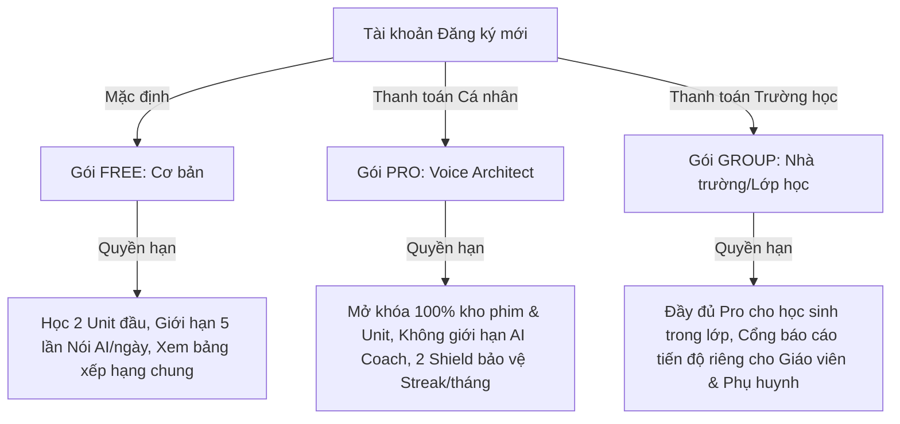
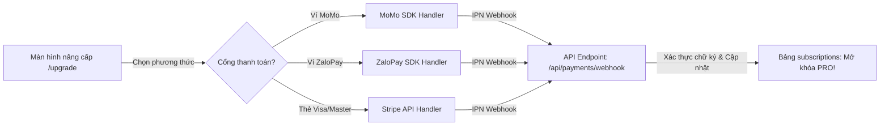

# 💰 THU HÚT, BẢN VỊ & MÔ HÌNH HÓA DOANH THU (GROWTH & MONETIZATION)
*Phase G — Subscription Framework, Local Payments & Gamified Retention Loops*

> [!IMPORTANT]
> Tài liệu này được thiết lập bởi CTO & EdTech Product Lead của Cinematic English, quy chuẩn hóa mô hình doanh thu của sản phẩm (Free vs Pro/Group Premium), cấu trúc tích hợp cổng thanh toán bản địa (MoMo, ZaloPay, Stripe) và hệ thống tăng trưởng hữu cơ (Referral/Streak protection).

---

## 💎 1. MÔ HÌNH PHÂN HẠNG TÀI KHOẢN (BUSINESS MONETIZATION MATRIX)

Hệ thống được thiết kế với ba gói tài khoản hướng tới các đối tượng học sinh, phụ huynh và nhà trường Việt Nam:



### Chi tiết hạn mức truy cập (Access Control Paywall):
- **Free User (Học sinh trải nghiệm)**: Mở khóa tối đa 2 Unit đầu tiên của mỗi khối lớp để làm quen. Giới hạn **5 lượt phân tích phát âm AI** mỗi ngày nhằm tối ưu hóa chi phí API vận hành ban đầu.
- **Pro User (Học sinh bứt phá)**: Phí đăng ký 79.000 VNĐ/tháng (hoặc 599.000 VNĐ/năm). Tiếp cận không giới hạn toàn bộ tính năng cao cấp của AI Coach.
- **Classroom/Group (Gói nhà trường)**: Chiết khấu đặc biệt cho các trường THPT mua bản quyền số lượng lớn cho toàn bộ học sinh trong khối lớp, tích hợp trang theo dõi học lực dành cho Giáo viên.

---

## 💳 2. KIẾN TRÚC TÍCH HỢP THANH TOÁN BẢN ĐỊA (LOCAL PAYMENTS ABSTRACTION)

Ứng dụng cung cấp một lớp trừu tượng hóa (Abstraction Layer) cho phép xử lý linh hoạt cả thanh toán quốc tế (Stripe) và các ví điện tử bản địa phổ biến nhất tại Việt Nam (MoMo, ZaloPay, VNPay):



### Giao diện kết nối cổng thanh toán mẫu (`lib/payments/paymentInterface.ts`):
```typescript
export interface PaymentRequest {
  orderId: string;
  amount: number;
  description: string;
  studentId: string;
  planType: 'Pro' | 'Group';
}

export interface PaymentResponse {
  success: boolean;
  paymentUrl?: string; // URL để điều hướng học sinh qua trang thanh toán của ví
  errorMessage?: string;
}

// Lớp trừu tượng xử lý điều phối cổng thanh toán
export class PaymentService {
  static async initiatePayment(provider: 'momo' | 'zalopay' | 'stripe', req: PaymentRequest): Promise<PaymentResponse> {
    const response = await fetch(`/api/payments/initiate`, {
      method: 'POST',
      headers: { 'Content-Type': 'application/json' },
      body: JSON.stringify({ provider, ...req })
    });
    return response.json();
  }
}
```

### Thiết kế Bảng quản lý Giao dịch & Thuê bao
```sql
-- 1. Bảng lưu trữ trạng thái đăng ký PRO hiện tại của học sinh
CREATE TABLE public.subscriptions (
    id UUID PRIMARY KEY DEFAULT gen_random_uuid(),
    student_id UUID REFERENCES public.profiles(id) ON DELETE CASCADE UNIQUE,
    plan_type VARCHAR(50) NOT NULL CHECK (plan_type IN ('Pro', 'Group')),
    status VARCHAR(50) DEFAULT 'active' CHECK (status IN ('active', 'expired', 'canceled')),
    current_period_start TIMESTAMP WITH TIME ZONE NOT NULL,
    current_period_end TIMESTAMP WITH TIME ZONE NOT NULL,
    cancel_at_period_end BOOLEAN DEFAULT FALSE,
    created_at TIMESTAMP WITH TIME ZONE DEFAULT CURRENT_TIMESTAMP
);
CREATE INDEX idx_subscriptions_expiry ON public.subscriptions(current_period_end ASC) WHERE status = 'active';

-- 2. Bảng lưu lịch sử giao dịch thanh toán thực tế
CREATE TABLE public.transactions (
    id UUID PRIMARY KEY DEFAULT gen_random_uuid(),
    student_id UUID REFERENCES public.profiles(id) ON DELETE SET NULL,
    order_id VARCHAR(100) UNIQUE NOT NULL,
    amount INTEGER NOT NULL, -- Số tiền giao dịch e.g., 79000
    payment_provider VARCHAR(50) NOT NULL, -- 'momo', 'zalopay', 'stripe'
    status VARCHAR(50) DEFAULT 'pending' CHECK (status IN ('pending', 'completed', 'failed')),
    raw_payload JSONB DEFAULT '{}', -- Log thô từ webhook ví điện tử gửi về
    created_at TIMESTAMP WITH TIME ZONE DEFAULT CURRENT_TIMESTAMP
);
```

---

## 🛡️ 3. KỸ THUẬT TĂNG TRƯỞNG & GIỮ CHÂN (RETENTION TRIGGERS)

Để tạo ra thói quen học tập bền vững mà không cần spam thông báo phiền phức, ứng dụng tích hợp 3 cơ chế tâm lý học hành vi:

1. **Khiên bảo vệ Chuỗi học tập (Streak Shield)**:
   - Cơ chế: Học sinh Pro có tối đa **2 khiên tự động kích hoạt** mỗi tháng.
   - Hoạt động: Nếu học sinh bỏ lỡ Nghi thức ngày hôm nay, 1 Khiên bảo vệ tự động kích hoạt để giữ nguyên Chuỗi ngày học (Streak) không bị reset về 0, giảm cảm giác thất vọng từ bỏ.
2. **Hào quang Lớp học (Classroom Aura)**:
   - Cơ chế: Khi 100% học sinh trong lớp hoàn thành nghi thức ngày học, toàn bộ thành viên lớp học nhận được nhân 1.5 lần điểm kinh nghiệm (XP) vào ngày tiếp theo. Tạo ra sự động viên nội bộ lành mạnh giữa các bạn học.
3. **Mời bạn học chung (Referral Invite Loop)**:
   - Cơ chế: Mỗi học sinh được cấp 1 mã giới thiệu độc bản.
   - Khi mời thành công 1 bạn học đăng ký và hoàn thành 3 ngày học đầu tiên: cả 2 học viên cùng nhận được **7 ngày sử dụng Pro miễn phí** và 1 chiếc Khiên bảo vệ Streak.

---

## 🛠️ 4. KẾ HOẠCH TRIỂN KHAI VÀ KHỞI CHẠY (GO-TO-MARKET PLAN)

1. **Khởi chạy Hệ thống Paywall**: Cài đặt middleware chặn truy cập đối với các Unit từ số 3 trở đi, điều hướng người dùng tới trang Nâng cấp `/upgrade` trực quan.
2. **Tích hợp Cổng thanh toán Sandbox**: Khởi tạo cấu hình kết nối Sandbox (Môi trường thử nghiệm) của ví MoMo và Stripe API để chạy thử nghiệm các giao dịch 0 VNĐ trên môi trường Dev.
3. **Khai thác Hệ thống mã giảm giá (Coupon/Referral)**: Viết các trigger cơ sở dữ liệu xử lý cộng ngày Pro miễn phí khi mã giới thiệu được nhập thành công.
4. **Chuẩn bị hạ tầng Production**: Chuyển đổi mã bảo mật kết nối và khóa webhook của MoMo/ZaloPay sang môi trường thực khi được cấp giấy phép kinh doanh EdTech chính thức.
