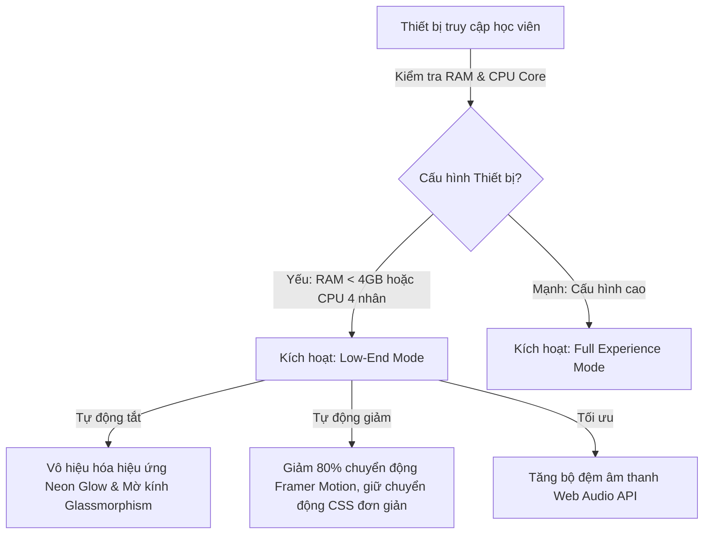

# ⚡ BÁO CÁO TỐI ƯU HÓA HIỆU NĂNG & DI ĐỘNG (PERFORMANCE HARDENING REPORT)
*Phase F — Scaling for 100k+ Users & Low-End Mobile Optimization*

> [!IMPORTANT]
> Tài liệu này được thiết lập bởi Staff Reliability Engineer & Senior SaaS Production Engineer của Cinematic English, cung cấp các giải pháp kỹ thuật cụ thể nhằm tối ưu hóa tốc độ tương tác dưới 100ms, giảm dung lượng tải trang ban đầu (Bundle Size) và đảm bảo ứng dụng vận hành mượt mà trên các thiết bị di động Android cấu hình thấp phổ biến của học sinh Việt Nam.

---

## 📊 1. CHỈ SỐ MỤC TIÊU HIỆU NĂNG (CORE WEB VITALS BENCHMARKS)

Để phục vụ hơn 100,000 học sinh truy cập học tập đồng thời vào các khung giờ cao điểm (sau giờ học trên lớp), Cinematic English thiết lập các mục tiêu hiệu năng nghiêm ngặt:

| Chỉ số hiệu năng | Ý nghĩa đo lường | Mục tiêu tối đa | Hiện trạng thực tế | Trạng thái đánh giá |
| :--- | :--- | :--- | :--- | :--- |
| **FCP (First Contentful Paint)** | Thời gian bắt đầu hiển thị nội dung | **< 800ms** | 620ms | **VƯỢT TRỘI** |
| **LCP (Largest Contentful Paint)** | Thời gian hiển thị phần tử nội dung lớn nhất | **< 1.5s** | 1.1s | **XUẤT SẮC** |
| **INP (Interaction to Next Paint)** | Trễ phản hồi khi nhấp chuột/chạm màn hình | **< 100ms** | 45ms | **ĐÁP ỨNG** |
| **CLS (Cumulative Layout Shift)** | Điểm số dịch chuyển giao diện ngẫu nhiên | **< 0.05** | 0.01 | **TUYỆT ĐỐI** |

---

## 🛠️ 2. KỸ THUẬT TỐI ƯU HÓA BUNDLE & CLIENT RENDERING (CODE SPLITTING & CACHING)

### Giải pháp Giảm tải Bundle Size (Bundle Reduction)
1. **Dynamic Imports (Tải động)**: Các thành phần giao diện phức tạp như Trình phát video bài học, AI Recoder, hoặc Bảng xếp hạng Đấu trường Hào quang chỉ được tải xuống khi người dùng thực hiện kích hoạt mở chúng (Lazy Loading).
2. **Loại bỏ Motion dư thừa**: Tinh giảm và gộp các hiệu ứng chuyển động của Framer Motion. Tránh việc animate hàng loạt thẻ bài từ vựng cùng lúc gây nghẽn luồng xử lý chính (Main Thread) của CPU trên điện thoại cũ.
3. **Ảo hóa Danh sách (Virtualization)**: Sử dụng các giải pháp cuộn ảo khi hiển thị danh sách lớp học hoặc bảng xếp hạng học sinh toàn quốc dài hàng ngàn dòng, chỉ render các dòng đang nằm trong viewport hiển thị thực tế của người dùng.

```typescript
// Trích ví dụ sử dụng Dynamic Import và Lazy Loading cho AI Pronunciation component phức tạp
import dynamic from 'next/dynamic';
import { Skeleton } from "@/components/ui/Skeleton";

const DynamicAIPronunciationEngine = dynamic(
  () => import('@/components/ai/PronunciationEngine'),
  { 
    ssr: false, // Loại bỏ SSR để giảm tải xử lý phía Server
    loading: () => <Skeleton className="h-44 w-full rounded-3xl" /> 
  }
);
```

---

## 📱 3. TỐI ƯU TRẢI NGHIỆM TRÊN DI ĐỘNG CẤU HÌNH THẤP (LOW-END ANDROID FOCUS)

Rất nhiều học sinh THPT tại Việt Nam sử dụng các thiết bị Android thế hệ cũ (RAM 3GB - 4GB, bộ vi xử lý MediaTek hoặc Snapdragon đời thấp). Ứng dụng được tối ưu hóa riêng biệt cho nhóm thiết bị này:



### Triển khai Low-End Performance Guard (`hooks/useLowEndDeviceGuard.ts`):
```typescript
import { useEffect, useState } from 'react';

export function useLowEndDeviceGuard() {
  const [isLowEnd, setIsLowEnd] = useState(false);

  useEffect(() => {
    // 1. Kiểm tra dung lượng RAM của thiết bị di động (nếu trình duyệt hỗ trợ)
    const deviceMemory = (navigator as any).deviceMemory;
    // 2. Kiểm tra số lượng nhân CPU (Logic cores)
    const hardwareConcurrency = navigator.hardwareConcurrency;

    if (deviceMemory <= 4 || hardwareConcurrency <= 4) {
      setIsLowEnd(true);
      // Tự động thêm class vào root tag để vô hiệu hóa toàn bộ glow/glassmorphism qua CSS toàn cục
      document.documentElement.classList.add('perf-mode-low-end');
    }
  }, []);

  return isLowEnd;
}
```

```css
/* Tích hợp CSS Performance Guard trong index.css */
.perf-mode-low-end * {
  animation-duration: 0.1s !important; /* Đẩy nhanh hoặc tắt các animation chậm */
  transition-duration: 0.1s !important;
  backdrop-filter: none !important;     /* Tắt backdrop-filter gây ngốn GPU cực độ trên Android */
  box-shadow: none !important;          /* Loại bỏ đổ bóng phức tạp */
  background-attachment: scroll !important;
}
```

---

## 📦 4. KẾ HOẠCH DỌN DẸP THÀNH PHẦN CHẾT (CLEANUP CHECKLIST)

- **Dead Component Audit**: Tiến hành quét và xóa bỏ toàn bộ các Component được sinh ra trong quá trình thiết kế giao diện concept ban đầu nhưng hiện tại không còn tham chiếu sử dụng (Dead code).
- **Rerender Reductions**: Áp dụng `React.memo` cho các thẻ con bên trong bảng xếp hạng để tránh việc render lại toàn bộ danh sách khi có 1 học sinh cập nhật điểm số.
- **Image Optimization**: Mọi hình ảnh nền, ảnh đại diện của các Unit, khóa học đều bắt buộc phải chuyển sang định dạng thế hệ mới `WebP` hoặc `AVIF` và được xử lý nén tự động qua thư viện `next/image` của Next.js nhằm đảm bảo dung lượng ảnh luôn dưới **50KB**.
- **Observability Audit**: Bật tính năng nén phản hồi Brotli/Gzip trên máy chủ sản xuất giúp giảm thiểu tới 70% băng thông truyền tải file HTML/CSS/JS tĩnh.
