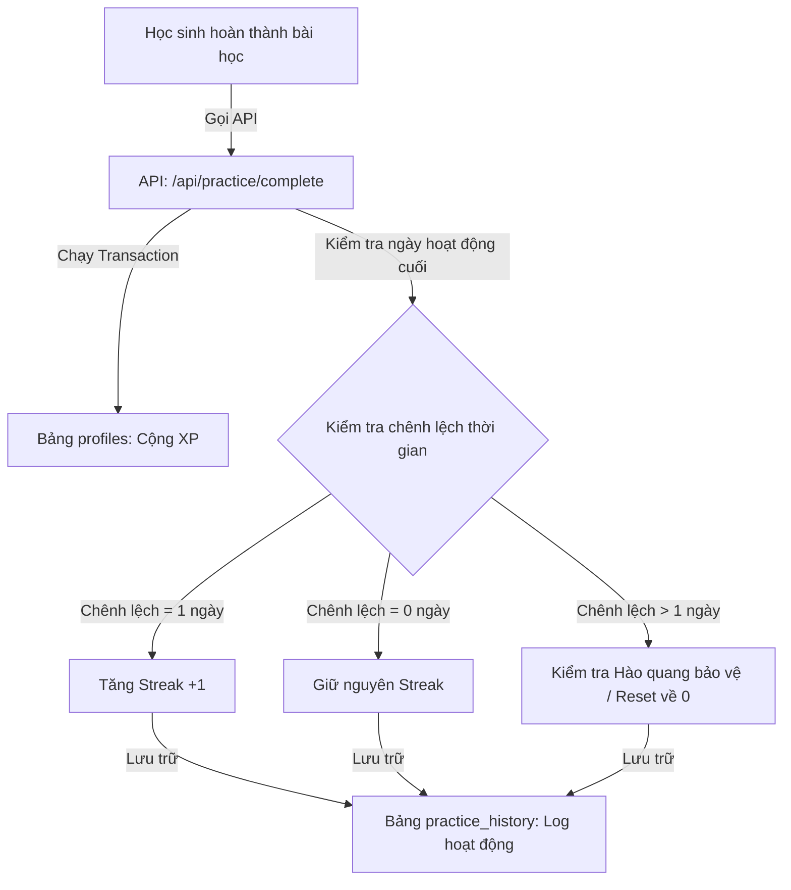
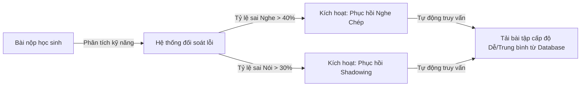

# 🎮 KIẾN TRÚC ĐỘNG CƠ LUYỆN TẬP THỰC TẾ (PRACTICE ENGINE & PERSISTENCE)
*Phase C — Real-time Progress, Spaced Repetition & Adaptive Difficulty*

> [!IMPORTANT]
> Tài liệu này được thiết lập bởi Staff Reliability Engineer & EdTech Lead của Cinematic English, quy chuẩn hóa cơ chế lưu trữ tiến trình học tập, thuật toán lặp lại ngắt quãng (Spaced Repetition), bảo vệ chuỗi học tập (Streak) và hệ thống gợi ý bài tập khắc phục tự động dựa trên lỗ hổng kiến thức của học sinh.

---

## 🔁 1. CHU KỲ BẢO VỆ CHUỖI HỌC TẬP THỰC TẾ (REAL STREAK & XP PERSISTENCE)

Hệ thống loại bỏ hoàn toàn việc lưu trữ cục bộ (Local Storage) dễ bị hack điểm, thay vào đó toàn bộ giao dịch XP và cập nhật ngày học được quản lý chặt chẽ thông qua các SQL Transaction ở Back-End:



---

## 🧠 2. THUẬT TOÁN LẶP LẠI NGẮT QUÃNG SM-2 (SPACED REPETITION ENGINE)

Để tối ưu hóa việc ghi nhớ từ vựng học đường lâu dài (IELTS & Phổ thông), Cinematic English áp dụng thuật toán lặp lại ngắt quãng SM-2 (SuperMemo-2) được tích hợp trong cơ sở dữ liệu:

### Công thức tính toán khoảng cách ôn tập (Interval Calculations)
Khi học sinh ôn tập một từ vựng, hệ thống yêu cầu đánh giá chất lượng phản hồi từ 0 đến 5 điểm ($q$). Các tham số được tính toán lại:
1. **Hệ số dễ học** ($EF$ - Easiness Factor):
   $$EF' = EF + (0.1 - (5 - q) \times (0.08 + (5 - q) \times 0.02))$$
   *Nếu $EF' < 1.3$, mặc định gán $EF' = 1.3$.*
2. **Khoảng cách ôn tập lần sau** ($I$ - Interval tính bằng ngày):
   - Nếu lần ôn tập đầu tiên ($n=1$): $I = 1$ ngày.
   - Nếu lần ôn tập thứ hai ($n=2$): $I = 6$ ngày.
   - Nếu lần ôn tập thứ ba trở đi ($n > 2$): $I_n = I_{n-1} \times EF$.

```sql
-- Dịch chuyển thuật toán SM-2 thành cấu trúc Database Tables
CREATE TABLE public.spaced_repetition_cards (
    id UUID PRIMARY KEY DEFAULT gen_random_uuid(),
    student_id UUID REFERENCES public.profiles(id) ON DELETE CASCADE,
    word_id VARCHAR(100) NOT NULL, -- Từ vựng cần ghi nhớ
    easiness_factor DOUBLE PRECISION DEFAULT 2.5, -- EF mặc định
    interval_days INTEGER DEFAULT 1, -- Khoảng cách ngày mặc định
    repetitions INTEGER DEFAULT 0, -- Số lần ôn tập thành công
    next_review_at TIMESTAMP WITH TIME ZONE DEFAULT CURRENT_TIMESTAMP,
    created_at TIMESTAMP WITH TIME ZONE DEFAULT CURRENT_TIMESTAMP
);
CREATE INDEX idx_spaced_repetition_due ON public.spaced_repetition_cards(student_id, next_review_at ASC);
```

---

## 📈 3. ĐỘNG CƠ CÁ NHÂN HÓA ĐỘ KHÓ DỰA TRÊN AI (ADAPTIVE DIFFICULTY SCHEMAS)

Hệ thống ghi nhận và phân tích chi tiết các hoạt động học tập (Learning Events) để xác định điểm yếu của học sinh, từ đó tự động đề xuất **Nhiệm vụ phục hồi** (Recovery Drills) tương ứng:



### Chi tiết bảng Lịch sử học tập & Phục hồi khuyết điểm
```sql
-- 1. Bảng lịch sử chi tiết buổi học (Để khôi phục trạng thái dang dở)
CREATE TABLE public.practice_history (
    id UUID PRIMARY KEY DEFAULT gen_random_uuid(),
    student_id UUID REFERENCES public.profiles(id) ON DELETE CASCADE,
    lesson_id UUID REFERENCES public.lessons(id) ON DELETE CASCADE,
    completed_activities INTEGER DEFAULT 0, -- Số hoạt động đã qua
    total_activities INTEGER NOT NULL,
    current_xp INTEGER DEFAULT 0,
    is_completed BOOLEAN DEFAULT FALSE,
    updated_at TIMESTAMP WITH TIME ZONE DEFAULT CURRENT_TIMESTAMP
);
CREATE INDEX idx_practice_history_active ON public.practice_history(student_id, is_completed) WHERE is_completed = FALSE;

-- 2. Bảng phục hồi khuyết điểm tự động của AI Coach
CREATE TABLE public.recovery_drills (
    id UUID PRIMARY KEY DEFAULT gen_random_uuid(),
    student_id UUID REFERENCES public.profiles(id) ON DELETE CASCADE,
    weak_skill VARCHAR(50) NOT NULL, -- 'listening_spelling', 'speaking_rhythm', 'vocabulary_recall'
    source_lesson_id UUID REFERENCES public.lessons(id) ON DELETE CASCADE,
    recommended_activity_id UUID NOT NULL,
    status VARCHAR(50) DEFAULT 'pending' CHECK (status IN ('pending', 'resolved')),
    created_at TIMESTAMP WITH TIME ZONE DEFAULT CURRENT_TIMESTAMP
);
CREATE INDEX idx_recovery_drills_pending ON public.recovery_drills(student_id, status) WHERE status = 'pending';
```

---

## 🛠️ 4. API HANDLER ĐÁNH GIÁ KẾT QUẢ & CẬP NHẬT TIẾN TRÌNH THỰC TẾ

```typescript
// /app/api/practice/complete/route.ts - API Cập nhật tiến trình & tính toán Chuỗi ngày học
import { createRouteHandlerClient } from '@supabase/auth-helpers-nextjs';
import { cookies } from 'next/headers';
import { NextResponse } from 'next/server';

export async function POST(req: Request) {
  const supabase = createRouteHandlerClient({ cookies });
  const { data: { session } } = await supabase.auth.getSession();
  
  if (!session) return NextResponse.json({ error: "Chưa đăng nhập" }, { status: 401 });
  const userId = session.user.id;

  try {
    const { lessonId, xpGained, accuracy } = await req.json();

    // 1. Bắt đầu Transaction cập nhật hồ sơ người dùng
    const { data: profile, error: profileErr } = await supabase
      .from('profiles')
      .select('total_xp, current_streak, last_active')
      .eq('id', userId)
      .single();

    if (profileErr || !profile) throw new Error("Không tìm thấy hồ sơ người dùng");

    const now = new Date();
    const lastActive = new Date(profile.last_active);
    
    // Tính toán chênh lệch ngày
    const diffTime = Math.abs(now.getTime() - lastActive.getTime());
    const diffDays = Math.ceil(diffTime / (1000 * 60 * 60 * 24));

    let newStreak = profile.current_streak;
    if (diffDays === 1) {
      newStreak += 1; // Học tiếp tục ngày hôm sau -> Tăng chuỗi!
    } else if (diffDays > 1) {
      newStreak = 1;  // Bị đứt chuỗi -> Reset về 1 trừ khi có bảo vệ
    }

    // 2. Cập nhật cơ sở dữ liệu
    await supabase.rpc('update_user_learning_stats', {
      user_uuid: userId,
      xp_to_add: xpGained,
      new_streak_val: newStreak,
      active_timestamp: now.toISOString()
    });

    // 3. Đánh giá chất lượng nếu độ chính xác yếu để đưa vào danh mục ôn tập phục hồi
    if (accuracy < 70) {
      // Tìm hoạt động yếu trong lesson để đưa vào danh sách phục hồi (recovery_drills)
      const { data: lessonActivities } = await supabase
        .from('activities')
        .select('id, type')
        .eq('lesson_id', lessonId);

      if (lessonActivities && lessonActivities.length > 0) {
        const weakSkillType = accuracy < 50 ? 'listening_spelling' : 'speaking_rhythm';
        await supabase.from('recovery_drills').insert({
          student_id: userId,
          weak_skill: weakSkillType,
          source_lesson_id: lessonId,
          recommended_activity_id: lessonActivities[0].id,
          status: 'pending'
        });
      }
    }

    return NextResponse.json({ 
      success: true, 
      xpEarned: xpGained, 
      streak: newStreak,
      message: "Cập nhật tiến trình học tập thực tế thành công!" 
    });
  } catch (error: any) {
    return NextResponse.json({ error: error.message }, { status: 500 });
  }
}
```

---

## 📈 5. KẾ HOẠCH TRIỂN KHAI PHASE C (PRODUCTIONIZATION ROADMAP)

1. **Khởi chạy SQL Function và RPC**: Thực thi các thủ tục lưu trữ an toàn Back-End nhằm thực hiện đồng thời việc tăng XP, cập nhật Streak và khóa trạng thái học tập của Học viên THPT.
2. **Kết nối Spaced Repetition vào Ôn tập Từ vựng**: Thay đổi cách lưu trữ từ vựng đã thuộc ở Thư viện thành thẻ SM-2 Spaced Repetition động, tự động thông báo ôn tập hàng ngày trên Dashboard.
3. **Mở cổng Khôi phục Trạng thái (Resume Session)**: Khi học sinh vô tình reload trang hoặc rớt mạng giữa chừng, Lesson Player sẽ tự động truy vấn dữ liệu từ bảng `practice_history` và cho phép học tiếp từ vị trí hiện tại mà không phải làm lại từ đầu.
