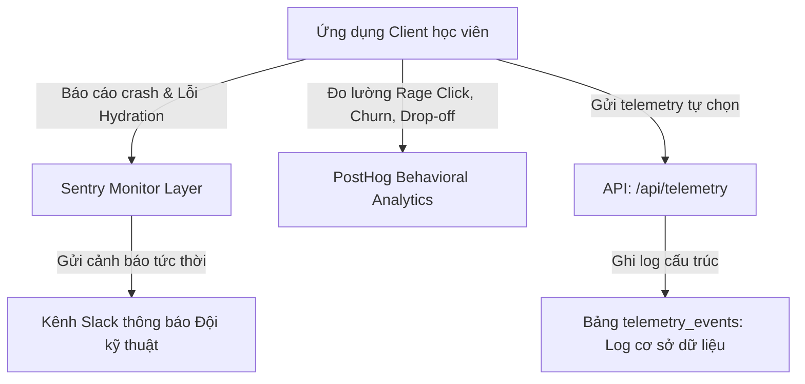

# 🛡️ KIẾN TRÚC GIÁM SÁT HỆ THỐNG & ĐỘ TIN CẬY (RELIABILITY & OBSERVABILITY)
*Phase E — Production-grade Telemetry, Sentry Tracing & PostHog Analytics*

> [!IMPORTANT]
> Tài liệu này được thiết lập bởi Staff Reliability Engineer của Cinematic English, quy chuẩn hóa cấu hình đo lường, giám sát lỗi sản xuất thời gian thực, cơ chế phát hiện lỗi Hydration và xử lý phản ứng tiêu cực của người dùng (Rage clicks/Abandonment) trên toàn hệ thống.

---

## 📊 1. KIẾN TRÚC ĐO LƯỜNG TẬP TRUNG (OBSERVABILITY STACK)

Cinematic English tích hợp giải pháp giám sát đa lớp nhằm phát hiện lỗi trước khi học sinh nhận ra:



### Phân vùng chức năng của các công cụ giám sát:
- **Sentry**: Giám sát lỗi Runtime của Javascript ở phía Client, lỗi API bất thường từ máy chủ Serverless, và đặc biệt là lỗi không đồng nhất cấu trúc HTML (Hydration Mismatch) - lỗi nguy hiểm phổ biến của các ứng dụng Next.js React 19.
- **PostHog**: Giám sát dòng chảy trải nghiệm (Product Analytics). Theo dõi tỷ lệ chuyển đổi từ đăng ký đến khi hoàn thành bài học đầu tiên, phát hiện các điểm nghẽn trải nghiệm khiến học sinh bỏ cuộc.

---

## 🔍 2. DO LƯỜNG HÀNH VI TIÊU CỰC VÀ GIÁN ĐOẠN (RAGE CLICK & ABANDON TRACKER)

### Khái niệm Rage Click & Abandonment:
- **Rage Click (Nhấp liên tục vì ức chế)**: Xảy ra khi một nút tương tác hoặc ô nhập liệu bị đơ, học sinh nhấp chuột liên tiếp 5 lần trở lên trong vòng 1 giây vào cùng một vị trí. Hệ thống sẽ phát hiện để gửi cảnh báo lỗi giao diện tự động.
- **Session Abandonment (Bỏ học giữa chừng)**: Học sinh thoát ứng dụng khi đang thực hiện dở dang bài nói AI hoặc bài kiểm tra tính giờ.

### React Integration Hook cho Đo lường và Rage Click (`hooks/useReliabilityTracker.ts`):
```typescript
import { useEffect } from 'react';
import { usePathname } from 'next/navigation';

export function useReliabilityTracker() {
  const pathname = usePathname();

  useEffect(() => {
    let clickQueue: { time: number; x: number; y: number }[] = [];

    const handleGlobalClick = (e: MouseEvent) => {
      const now = Date.now();
      clickQueue.push({ time: now, x: e.clientX, y: e.clientY });

      // Chỉ giữ lại các click trong vòng 1 giây gần nhất
      clickQueue = clickQueue.filter(click => now - click.time < 1000);

      // Nếu có từ 5 click trở lên trong 1 giây -> Phát hiện Rage Click!
      if (clickQueue.length >= 5) {
        const firstClick = clickQueue[0];
        const isSameTarget = clickQueue.every(
          click => Math.abs(click.x - firstClick.x) < 20 && Math.abs(click.y - firstClick.y) < 20
        );

        if (isSameTarget) {
          sendTelemetryEvent('rage_click', {
            pathname,
            coordinate: { x: e.clientX, y: e.clientY },
            elementId: (e.target as HTMLElement).id || 'unknown',
            elementClass: (e.target as HTMLElement).className || 'unknown'
          });
          // Làm trống queue để tránh phát hiện trùng lặp liên tục
          clickQueue = [];
        }
      }
    };

    window.addEventListener('click', handleGlobalClick);
    return () => window.removeEventListener('click', handleGlobalClick);
  }, [pathname]);
}

// Hàm gửi log nội bộ lên cơ sở dữ liệu
async function sendTelemetryEvent(type: string, payload: any) {
  try {
    await fetch('/api/telemetry', {
      method: 'POST',
      headers: { 'Content-Type': 'application/json' },
      body: JSON.stringify({ eventType: type, payload })
    });
  } catch (err) {
    console.error("Telemetry failed to send:", err);
  }
}
```

---

## 🛡️ 3. MÀN HÌNH BẢO VỆ LỖI GIAO DIỆN (REACT ERROR BOUNDARY FALLBACKS)

Để tránh tình trạng 1 lỗi logic nhỏ làm sập toàn bộ ứng dụng (Trắng trang màn hình), Cinematic English sử dụng các Ranh giới bảo vệ lỗi (`Error Boundary`) bao bọc các cấu phần riêng biệt:

```typescript
// components/reliability/ErrorBoundaryFallback.tsx - Giao diện khắc phục lỗi cao cấp thuần Việt
'use client';

import React from 'react';
import { RefreshCw, Home } from 'lucide-react';

interface Props {
  error: Error;
  resetErrorBoundary: () => void;
}

export default function ErrorBoundaryFallback({ error, resetErrorBoundary }: Props) {
  return (
    <div className="min-h-[400px] rounded-3xl border border-white/5 bg-[#141414] p-8 flex flex-col items-center justify-center text-center space-y-6">
      <div className="w-16 h-16 rounded-full bg-red-500/10 border border-red-500/20 flex items-center justify-center text-red-500">
        ⚠️
      </div>
      
      <div className="space-y-2">
        <h3 className="text-xl font-display font-black text-white">Đã xảy ra sự cố kỹ thuật</h3>
        <p className="text-secondary text-xs max-w-md mx-auto italic">
          Hệ thống gặp gián đoạn nhỏ khi hiển thị cấu phần này. Chi tiết lỗi đã được gửi tự động đến đội ngũ kỹ thuật để khắc phục.
        </p>
      </div>

      <div className="flex items-center gap-3">
        <button
          onClick={resetErrorBoundary}
          className="px-5 py-2.5 rounded-2xl bg-white text-black text-xs font-black uppercase tracking-widest hover:scale-105 transition-transform flex items-center gap-2 cursor-pointer"
        >
          <RefreshCw size={14} /> Thử tải lại cấu phần
        </button>
        <button
          onClick={() => window.location.href = '/dashboard'}
          className="px-5 py-2.5 rounded-2xl bg-white/5 border border-white/5 text-white text-xs font-black uppercase tracking-widest hover:bg-white/10 transition-all flex items-center gap-2 cursor-pointer"
        >
          <Home size={14} /> Về Trang chủ
        </button>
      </div>
    </div>
  );
}
```

---

## 📈 4. THỦ TỤC TRUY VẤN LOG TRÊN PRODUCTION (OBSERVABILITY PROTOCOLS)

- **Audit Trails**: Mọi thao tác quản lý dữ liệu lớn (Bulk Import, thay đổi cấu trúc điểm thi) tại Cổng CMS đều được ghi nhật ký vào bảng `telemetry_events` kèm theo ID của admin thực hiện nhằm chống gian lận và kiểm soát lịch sử thao tác.
- **Quan trắc Tốc độ phản hồi (Slow Routes Audits)**: Next.js Web Vitals được thu thập tự động qua PostHog nhằm phát hiện bất kỳ route nào có độ trễ phản hồi ban đầu (Time To First Byte - TTFB) vượt quá **250ms**.
- **Observability Checklist**:
  - [ ] Đã kích hoạt cấu hình SDK Sentry trong `sentry.client.config.ts` và `sentry.server.config.ts`.
  - [ ] Bật PostHog Session Recording giúp tái hiện lại 100% video thao tác của học sinh khi gặp crash.
  - [ ] Thiết lập cảnh báo tự động trên Sentry đối với các lỗi cấp độ `Critical` xảy ra quá 10 lần trong 1 giờ.
