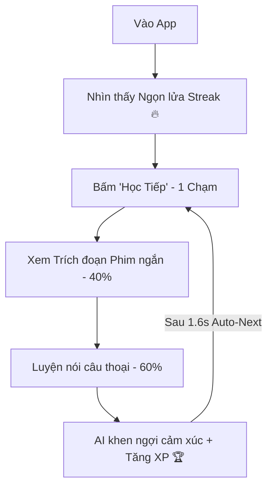

# 🎯 Cinematic English | Retention Engineering & Product Intelligence
**Định hướng chiến lược tối thượng:** Giữ sản phẩm cực kỳ tối giản, gây nghiện, tập trung vào cảm xúc, tối ưu hiển thị Mobile-first và 100% xoay quanh khả năng Luyện Nói.

---

## 🛑 ĐIỀU KHOẢN SỬA ĐỔI ĐẶC BIỆT: ƯU TIÊN 100% TRẢI NGHIỆM HỌC VIÊN (STUDENT-ONLY)
> **TUYỆT ĐỐI KHÔNG xây dựng bất kỳ hệ thống dành cho Giáo viên (Teacher Systems) nào ở giai đoạn này.**

*Hệ thống Giáo viên sẽ chỉ được xem xét khi và chỉ khi sản phẩm đạt được: Chỉ số giữ chân (Retention) vượt trội, Động cơ học tập ổn định, Lượng người dùng hàng ngày tích cực và Kho nội dung đã được mở rộng quy mô.*

---

## ⚡ GIAI ĐOẠN 2: TỐI ƯU HÓA GIỮ CHÂN & DOANH THU (RETENTION + MONETIZATION)
> **Dừng mở rộng tính năng mới. Tập trung 100% vào chất lượng vận hành sản phẩm (Product Quality) để kích thích thói quen học nói hàng ngày.**

### 🏃 1. Tốc độ & Trải nghiệm Tức thì (Speed Perception)
*   **Optimistic UI:** Phản hồi giao diện ngay lập tức khi người dùng thao tác ghi âm (Micro) mà không đợi API tải xong.
*   **Instant Transitions:** Chuyển câu thoại cực nhanh trong vòng 1.5 - 1.6 giây.
*   **Asset Preloading:** Tải trước (preload) các tài nguyên của câu thoại tiếp theo (như audio mẫu, hình ảnh) ngay khi học viên đang ghi âm câu thoại hiện tại.

### 💖 2. Kích thích Dopamine & Cảm xúc (Emotional Retention)
*   **Streak Celebration:** Hiển thị ngọn lửa Streak 🔥 bùng cháy rực rỡ với các micro-animations tinh tế mỗi ngày khi học viên duy trì việc luyện nói.
*   **XP Micro-animations:** Hiệu ứng điểm thưởng XP nhảy liên tục và âm thanh chiến thắng giòn giã khi kết thúc bài học để kích thích cảm giác chinh phục.
*   **AI Coach Feedback:** Dùng những câu khen ngợi đầy cảm xúc và cá nhân hóa từ AI thay vì trả về những điểm số toán học khô khan.

### 📊 3. Đo lường Chỉ số Sức khỏe (Analytics Intelligence)
Hệ thống Telemetry tập trung đo lường 6 chỉ số sinh mệnh của speaking engine:
1.  *Lesson Completion Rate (Tỷ lệ hoàn thành bài học).*
2.  *Retry Behavior (Tâm lý luyện nói lại cùng 1 câu thoại).*
3.  *Abandonment Timing (Thời điểm bỏ bài học để tìm ra câu thoại gây nản chí).*
4.  *Daily Streak Survival (Tỷ lệ duy trì chuỗi ngọn lửa).*
5.  *Repeat Sessions (Tỷ lệ quay lại bài học cũ).*
6.  *Session Duration (Tổng thời lượng luyện tập trong 1 phiên).*

### 💰 4. Tối ưu hóa Chi phí AI (AI Cost Optimization)
Giảm tải các cuộc gọi API đắt đỏ lên OpenAI bằng cách:
*   Sử dụng các mẫu đánh giá cố định (Deterministic Templates) khi giọng nói trùng khớp cao.
*   Cơ chế đệm kết quả (Cached Responses) cho các trích đoạn phổ biến.
*   Sử dụng các mô hình gọn nhẹ hoặc xử lý biên dịch cục bộ (Local Client-side parsing) khi thích hợp để duy trì chi phí vận hành ở mức tiệm cận 0đ.

### 🛡️ 5. Sẵn sàng Chốt Sales (Monetization Readiness)
Tạo phễu chuyển đổi nhẹ nhàng, tự nhiên nhưng hiệu quả:
*   Giới hạn lượt AI chấm điểm miễn phí mỗi ngày (Free limits).
*   Các bảng nâng cấp (PRO gating) hiển thị tinh tế khi chạm giới hạn.
*   Các lời kêu gọi (Subscription nudges) lồng ghép ấm áp giúp người dùng hiểu giá trị của gói PRO.

---

## ⚡ 6. Công thức sản phẩm: "TikTok + Duolingo + ELSA"
Chúng ta không xây dựng một hệ thống quản lý học tập (LMS) nặng nề như Coursera. Hệ thống này được tối ưu hóa để tạo thói quen luyện nói hàng ngày bằng cách kích thích các hormone hạnh phúc (Dopamine, Endorphin).

