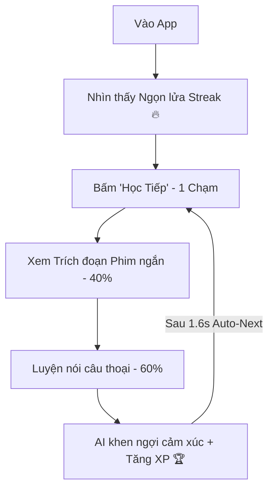

# 🎯 Cinematic English | Retention Engineering & Product Intelligence
**Định hướng chiến lược tối thượng:** Giữ giao diện cực kỳ tối giản và giàu cảm xúc ở Frontend (Lightweight & Emotional UI) nhưng cực kỳ kiên cố, bảo mật và chuẩn hóa ở Backend (Production-Grade Backend).

---

## 🛑 ĐIỀU KHOẢN SỬA ĐỔI ĐẶC BIỆT: ƯU TIÊN 100% TRẢI NGHIỆM HỌC VIÊN (STUDENT-ONLY)
> **TUYỆT ĐỐI KHÔNG xây dựng bất kỳ hệ thống dành cho Giáo viên (Teacher Systems) nào ở giai đoạn này.**

*Hệ thống Giáo viên sẽ chỉ được xem xét khi và chỉ khi sản phẩm đạt được: Chỉ số giữ chân (Retention) vượt trội, Động cơ học tập ổn định, Lượng người dùng hàng ngày tích cực và Kho nội dung đã được mở rộng quy mô.*

---

## 🛡️ NGUYÊN TẮC KỸ THUẬT PRODUCTION-READY (REAL PRODUCT ONLY)
> **Chúng ta KHÔNG xây dựng Bản thử nghiệm (Demo) nữa. Chúng ta đang vận hành với TƯ DUY CỦA MỘT CÔNG TY PHẦN MỀM THỰC THỤ.**

### 💾 1. Cơ sở dữ liệu Thực chất (Real Database Architecture)
*   **Không dữ liệu cứng (No Hardcoded Logic):** Toàn bộ bài học, phân cảnh phim, phụ đề tiếng Anh, bản dịch tiếng Việt, độ khó và siêu dữ liệu (metadata) của bài học đều phải được truy vấn động từ cơ sở dữ liệu Supabase.
*   **Không tiến trình ảo (No Fake Progress):** Trạng thái học tập của người dùng phải được lưu vết thực chất trong DB để đảm bảo tính nhất quán trên mọi thiết bị.

### 👤 2. Trạng thái Người dùng Thực tế (Real User State)
Học viên sở hữu các chỉ số được lưu trữ và cập nhật tự động tại Server:
*   *Real XP:* Điểm kinh nghiệm tích lũy thực tế sau mỗi bài nói.
*   *Real Streaks:* Chuỗi ngọn lửa tính toán động dựa trên mốc thời gian hoạt động thực chất của người dùng.
*   *Real Lesson & Pronunciation History:* Nhật ký luyện nói và lịch sử sửa âm tiết cụ thể từng câu để phục vụ biểu đồ phân tích.
*   *Real Subscriptions & Quotas:* Hạn ngạch (Quota) chấm điểm AI và trạng thái gói cước (Free vs PRO) được kiểm soát nghiêm ngặt.

### ⚙️ 3. Phục hồi & Độ tin cậy Cao (Production Reliability)
Hệ thống phải có khả năng tự phục hồi và chống chịu lỗi cao:
*   *Retries & Fallbacks:* Tự động thử lại khi API Whisper/OpenAI bị nghẽn, hoặc tự động chuyển hướng qua mô hình dự phòng.
*   *Graceful Degradation:* Khi AI offline, hệ thống vẫn cho phép người dùng ghi âm và tự động chấm điểm cục bộ (client-side matching) để buổi học không bao giờ bị gián đoạn.
*   *Timeout handling:* Tự động ngắt kết nối và thông báo trực quan khi thời gian phân tích vượt quá 8 giây, không để người dùng chờ đợi vô hạn.

---

## ⚡ CÁC QUY TẮC BACKEND NGIÊM NGẶT (STRICT SERVER RULES)
Để phục vụ mục tiêu **tối ưu cho 100 người dùng thật với tỉ lệ giữ chân xuất sắc**, chúng ta áp dụng các chuẩn mực kỹ thuật cao nhất tại Backend:

### 1. Chuẩn hóa thiết kế Database (Data Integrity):
*   **Standardize Naming:** Toàn bộ tên bảng, tên cột phải tuân thủ chuẩn `snake_case` (ví dụ: `user_id`, `created_at`, `speaking_accuracy`).
*   **UUID Consistency:** Sử dụng định danh duy nhất UUID làm Khóa chính (Primary Keys) cho tất cả các thực thể (Users, Lessons, Activities, Telemetry).
*   **Time Tracking:** Bắt buộc thêm hai trường `created_at` và `updated_at` (với default value là `NOW()`) trên tất cả các bảng dữ liệu để giám sát vòng đời dữ liệu chính xác.

### 2. Xác thực Hạn ngạch & Quyền lợi độc quyền tại Server (Monetization & Quota Security):
*   **Validate Quotas Server-Side Only:** Tuyệt đối không lưu trữ hoặc kiểm tra giới hạn lượt dùng thử AI, lượt học bài hát, gói PRO ở Client. Mọi hoạt động trừ quota hay phân quyền xem phim chỉ được tính toán và thực thi thông qua **Server-side guards (API endpoint & Database RLS)**.
*   **Never Trust Frontend:** Client chỉ gửi yêu cầu ghi âm hoặc tải dữ liệu thô. Quyết định cho phép hay chặn, cộng trừ điểm kinh nghiệm XP, ghi nhận Streak hoàn toàn thuộc về Server Logic.

### 3. Chuẩn hóa Dữ liệu Nghiệp vụ & Chống Lạm dụng (Abuse Protection):
*   **Normalize Analytics Events:** Chuẩn hóa các trường siêu dữ liệu trong `telemetry_events` để đảm bảo báo cáo trực quan sạch sẽ.
*   **Rate Limiting & Abuse Prevention:** Tích hợp cơ chế giới hạn tần suất gọi API (Rate Limiting) trên các endpoint AI chấm âm để ngăn chặn hành vi phá hoại hoặc dùng tool spam ghi âm gây đội chi phí API của hệ thống.

---

## ⚡ GIAI ĐOẠN 2: TỐI ƯU HÓA GIỮ CHÂN & DOANH THU (RETENTION + MONETIZATION)
> **Dừng mở rộng tính năng mới. Tập trung 100% vào chất lượng vận hành sản phẩm (Product Quality) để kích thích thói quen học nói hàng ngày.**

### 🏃 1. Tốc độ & Trải nghiệm Tức thì (Speed Perception)
*   **Optimistic UI:** Phản hồi giao diện ngay lập tức khi người dùng thao tác ghi âm (Micro) mà không đợi API tải xong.
*   **Instant Transitions:** Chuyển câu thoại cực nhanh trong vòng 1.5 - 1.6 giây.
*   **Asset Preloading:** Tải trước (preload) các tài nguyên của câu thoại tiếp theo (như audio mẫu, hình ảnh) ngay khi học viên đang ghi âm câu thoại hiện tại.

### 💖 2. Kích thích Dopamine & Cảm xúc (Emotional Retention)
*   **Streak Celebration:** Hiển thị ngọn lửa Streak 🔥 bùng cháy rực rỡ với các micro-animations tinh tế mỗi ngày khi học viên duy trì việc luyện nói.
*   **XP Micro-animations:** Hiệu ứng điểm thưởng XP nhảy liên tục và âm thanh chiến thắng giòn giã khi kết thúc bài học để kích thích cảm giác chinh phục.
*   **AI Coach Feedback:** Dùng những câu khen ngợi đầy cảm xúc và cá nhân hóa từ AI thay vì trả về những điểm số toán học khô khan.

### 📊 3. Đo lường Chỉ số Sức khỏe (Analytics Intelligence)
Hệ thống Telemetry tập trung đo lường 6 chỉ số sinh mệnh của speaking engine:
1.  *Lesson Completion Rate (Tỷ lệ hoàn thành bài học).*
2.  *Retry Behavior (Tâm lý luyện nói lại cùng 1 câu thoại).*
3.  *Abandonment Timing (Thời điểm bỏ bài học để tìm ra câu thoại gây nản chí).*
4.  *Daily Streak Survival (Tỷ lệ duy trì chuỗi ngọn lửa).*
5.  *Repeat Sessions (Tỷ lệ quay lại bài học cũ).*
6.  *Session Duration (Tổng thời lượng luyện tập trong 1 phiên).*

---

## ⚡ 8. Công thức sản phẩm: "TikTok + Duolingo + ELSA"
Chúng ta không xây dựng một hệ thống quản lý học tập (LMS) nặng nề như Coursera. Hệ thống này được tối ưu hóa để tạo thói quen luyện nói hàng ngày bằng cách kích thích các hormone hạnh phúc (Dopamine, Endorphin).

