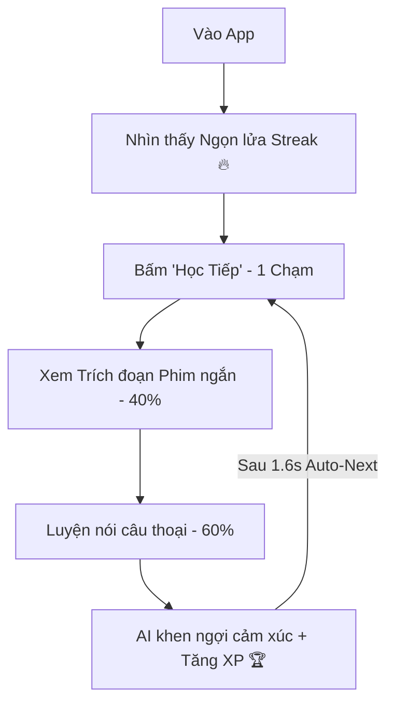

# 🎯 Cinematic English | Retention Engineering & Product Intelligence
**Định hướng chiến lược tối thượng:** Giữ sản phẩm cực kỳ tối giản, gây nghiện, tập trung vào cảm xúc, tối ưu hiển thị Mobile-first và 100% xoay quanh khả năng Luyện Nói.

---

## ⚡ 1. Công thức sản phẩm: "TikTok + Duolingo + ELSA"
Chúng ta không xây dựng một hệ thống quản lý học tập (LMS) nặng nề như Coursera. Hệ thống này được tối ưu hóa để tạo thói quen luyện nói hàng ngày bằng cách kích thích các hormone hạnh phúc (Dopamine, Endorphin).

---

## 🛑 2. Bộ lọc Quyết định Tính năng (The Ultimate Filter)
Từ nay về sau, bất kỳ dòng code hay tính năng mới nào được đề xuất đều phải vượt qua bộ lọc duy nhất này:
> **"Tính năng này có giúp tăng tỷ lệ học viên Luyện Nói Hàng Ngày (Daily Speaking Retention) hay không?"**
*   **Nếu CÓ:** Triển khai ngay lập tức, tối giản hóa tối đa các bước chạm.
*   **Nếu KHÔNG:** Không xây dựng, loại bỏ ngay từ khâu ý tưởng.

---

## 🟢 3. Danh sách ĐƯỢC PHÉP phát triển (Keep & Optimize)
1.  **Hệ thống chuỗi Streak gây nghiện:** Biểu tượng ngọn lửa rực cháy, cơ chế "bảo vệ chuỗi" khi người dùng nghỉ 1 ngày (Streak Shield).
2.  **XP & Tiến trình liên tục:** Điểm số nhảy liên tục sau mỗi câu nói đúng, âm thanh chúc mừng chiến thắng vang lên khi kết thúc bài học.
3.  **Vòng lặp bài học siêu tốc (Frictionless Loop):** Thời gian tải bài học < 1 giây, tự động chuyển câu (Auto-advance) sau 1.5 giây mà không cần bấm nút "Tiếp tục".
4.  **Lời khen cảm xúc (Emotional Feedback):** Sử dụng các câu thoại ấm áp, đầy khích lệ từ AI như *"Rất tốt! 🔥"*, *"Nghe tự nhiên hơn rồi! 👌"* thay vì hiển thị điểm số phần trăm khô khan.

---

## 🔴 4. Danh sách CẤM / LOẠI BỎ (Avoid & Kill List)
*   **Hạn chế tối đa:** Giao diện quản lý lớp học (LMS), bảng điều khiển giáo viên phức tạp.
*   **Không phát triển thêm:** Các dạng bài tập học thuật như trắc nghiệm (multiple-choice), điền vào chỗ trống (fill blanks), hay chép chính tả (dictation).
*   **Xóa bỏ:** Các luồng Onboarding ép buộc người dùng làm khảo sát trước khi được dùng thử.
*   **Không thêm:** Menu cài đặt nhiều cấp, quản trị phân quyền doanh nghiệp (Enterprise SaaS).

---

## 🏆 5. Tôn chỉ Thiết kế Trải nghiệm Người dùng (UX Dogma)
*   **Subtitle is the Hero:** Chữ to rõ, tương phản cao để đọc lướt nhanh trên điện thoại.
*   **Giant Mic Target:** Nút bấm ghi âm chiếm vị trí trung tâm, thao tác bằng 1 tay cực kỳ thoải mái.
*   **Fake Responsiveness:** Giao diện sóng âm chuyển động ngay lập tức khi nhấn Mic, tạo cảm giác app cực kỳ nhạy bén.
