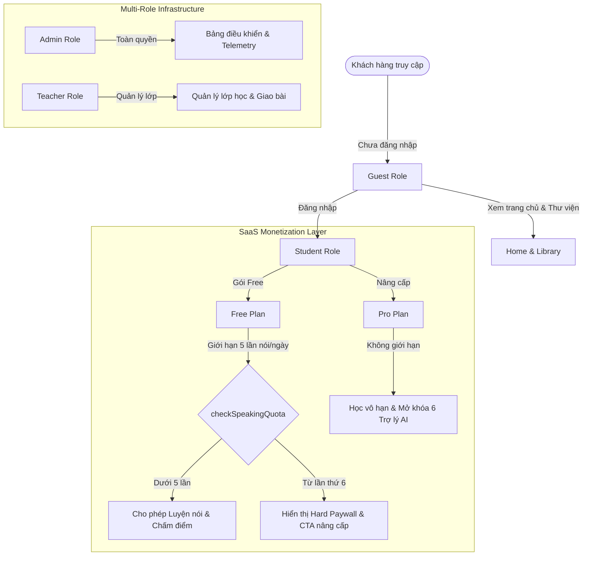

# 🎬 Cinematic English | Bản Hiểu Biết Toàn Diện Về Dự Án (Project Deep-Dive & Architecture Map)

Chào bạn! Dưới đây là tài liệu tổng hợp chi tiết và hệ thống hóa toàn bộ các khía cạnh cốt lõi của **Cinematic English** dựa trên việc phân tích các tài liệu chiến lược, cấu trúc thư mục, hệ thống phân quyền (RBAC), monetization SaaS, và phong cách thiết kế cao cấp của dự án.

Tài liệu này được biên soạn theo đúng tinh thần của **Cinematic English Startup OS** để làm kim chỉ nam cho tất cả các bước phát triển và bảo trì tiếp theo.

---

## 1. 🌟 Triết Lý Cốt Lõi & Trải Nghiệm Khách Hàng (Core Philosophy & UX)

Cinematic English không đơn thuần là một ứng dụng học tiếng Anh; đây là **"Netflix của việc học ngôn ngữ"** (Netflix, not school). 

### 🎭 Ba Trụ Cột Chiến Lược:
1. **Sự Nhập Vai Cảm Xúc (Emotional Immersion):** Tận dụng âm thanh điện ảnh, cốt truyện lôi cuốn, và giao diện chuyển động mượt mà để đưa người học vào trạng thái tập trung sâu.
2. **Khơi Gợi Tự Tin (Confidence-First Interactions):** Tránh xa việc đánh giá điểm số một cách máy móc, gây áp lực (Non-Toxic Scoring). Thay vì gạch đỏ những lỗi sai, AI Coach tập trung khen ngợi nhịp điệu (cadence) và chỉ gợi ý tối đa **2 vùng cải thiện khả thi** cho mỗi lượt nói để bảo vệ động lực học viên.
3. **Thay Đổi Bản Sắc (Identity Transformation):** Loại bỏ hệ thống cấp độ (Level) trẻ con hay khô khan của trường học. Người học tiến hóa qua các giai đoạn mang tính khẳng định bản thân:
   $$\text{Silent Observer} \longrightarrow \text{Seeker} \longrightarrow \text{Speaker} \longrightarrow \text{Storywalker} \longrightarrow \text{Protagonist} \longrightarrow \text{Director} \longrightarrow \text{Voice Architect}$$

---

## 2. 🎨 Hệ Thống Thiết Kế Cao Cấp (Cinematic UI & Motion System)

Giao diện của Cinematic English tuân thủ các chuẩn mực khắt khe nhất để đạt mức **Premium (Apple-level UX)**.

### 🎨 Bảng Màu & Trực Quan (Color Tokens):
*   **Màu Nền (Backgrounds):** Siêu tối (`--bg-primary`: `#050508`, `--bg-secondary`: `#0a0a12`).
*   **Thủy Tinh (Glassmorphic Elements):** Sử dụng các tấm kính mờ (`--bg-glass`) kết hợp hiệu ứng viền sáng tinh tế.
*   **Điểm Nhấn (Accents & Glows):**
    *   `Gold` (`#f5c842`): Sự thành tựu, gói hội viên Premium/Pro.
    *   `Violet` (`#8b5cf6`): Lõi nhận diện thương hiệu, biểu trưng cho sự bí ẩn và sâu lắng.
    *   `Cyan` (`#06b6d4`): Tính trí tuệ, biểu trưng cho AI và huấn luyện viên.
    *   `Emerald` (`#10b981`): Sự tiến bộ, thành công, trạng thái tích cực.

### ✍️ Typography:
*   **Headline/Hero:** Phông chữ hiển thị **Outfit** tạo cảm giác hiện đại, phóng khoáng.
*   **Body/UI:** Phông chữ **Inter** đảm bảo tính dễ đọc cao trên mọi kích thước màn hình.
*   **Data/Phonetics:** Phông chữ **JetBrains Mono** chuyên nghiệp cho các thông số kỹ thuật và phiên âm quốc tế.

### 🎬 Hiệu Ứng Chuyển Động (Motion Design):
*   **Focus Mode:** Tự động mờ dần (fade-out) các nút điều khiển UI sau 5 giây không tương tác trong lúc nghe truyện, giữ sự tập trung trọn vẹn vào nội dung.
*   **Waveform:** Trình hiển thị sóng âm động kích thích giác quan khi thu âm hoặc phát audio.
*   **Transitions:** Chuyển động mượt mà sử dụng Framer Motion kết hợp các thông số cubic-bezier chậm rãi kiểu điện ảnh.

---

## 3. ⚙️ Kiến Trúc Hệ Thống & Monetization SaaS

Hệ thống kinh doanh và phân quyền của Cinematic English đã được thiết kế sẵn sàng cho việc mở rộng quy mô SaaS.

### 📊 Ma Trận Đặc Quyền & Quota (Entitlement Matrix):

| Đặc quyền / Gói | Free (Miễn phí) | Pro (Học viên Pro) | Team (Nhóm/Lớp) | School (Trường học) |
| :--- | :--- | :--- | :--- | :--- |
| **Giá thành** | $0đ | 199k / tháng | 599k / tháng | Liên hệ |
| **Luyện phát âm AI** | 5 lần / ngày | Vô hạn | Vô hạn | Vô hạn |
| **Phút trò chuyện AI** | 10 phút / ngày | Vô hạn | Vô hạn | Vô hạn |
| **Nhân vật AI** | 1 (Mặc định) | 6 nhân vật cao cấp | 6 + Tùy chỉnh | 6 + Tùy chỉnh |
| **Học offline** | ❌ | ✅ | ✅ | ✅ |
| **Ôn tập thông minh**| ❌ | ✅ | ✅ | ✅ |
| **Quản lý lớp học** | ❌ | ❌ | ✅ (Tối đa 10 người) | ✅ (Không giới hạn) |

### 🔒 Server-Side Protection (Bảo mật phía máy chủ):
Hệ thống không chỉ ẩn nút trên UI mà còn bảo vệ triệt để ở mức API thông qua các hàm Guard tại `src/lib/monetization/guards.ts` và `src/lib/auth/rbac.ts`:
*   **`checkSpeakingQuota`**: Đếm trực tiếp số file ghi âm người dùng đã tải lên Supabase Storage trong ngày. Nếu vượt ngưỡng của gói hiện tại, API Server Action lập tức ngắt kết nối và trả về lỗi `PaywallError` có cấu trúc rõ ràng kèm lời kêu gọi nâng cấp gói Pro.
*   **Middleware Bảo vệ Tuyến (`middleware.ts`)**: Phân tách luồng truy cập nghiêm ngặt:
    *   Học viên (`Student`) bị chặn hoàn toàn khỏi phân vùng `/admin` và `/teacher`.
    *   Giáo viên (`Teacher`) có quyền truy cập `/teacher` nhưng bị chặn khỏi `/admin`.
    *   Khách (`Guest`) bị chặn khỏi toàn bộ các phân vùng ứng dụng nội bộ (`/learn`, `/chat`, `/dashboard`).

---

## 4. 💳 Cổng Thanh Toán Đa Dạng (Billing Abstraction Layer)

Cấu trúc code tại [billing.ts](file:///d:/Antigravity_Projects/cinematic-english/src/lib/monetization/billing.ts) sử dụng mô hình thiết kế **Polymorphism (Đa hình)**, sẵn sàng để kích hoạt các kênh thanh toán quốc tế và nội địa:

1.  **StripeBillingProvider:** Dùng cho thẻ Visa/Mastercard quốc tế.
2.  **MomoBillingProvider / ZaloPayBillingProvider:** Dùng cho ví điện tử phổ biến tại Việt Nam.
3.  **QR Banking (VietQR):** Hỗ trợ tạo mã QR chuyển khoản nhanh ngân hàng nội địa (cực kỳ phù hợp thị trường Việt Nam).

Đội ngũ phát triển chỉ cần truyền API key chuẩn vào `.env.local` là hệ thống có thể kết nối ngay lập tức nhờ giao diện `IBillingProvider` thống nhất.

---

## 5. 📈 Đo Lường & Tối Ưu Tỷ Lệ Chuyển Đổi (Observability & Telemetry)

Hệ thống đo lường hiệu năng và hành vi của người dùng tại [observability.ts](file:///d:/Antigravity_Projects/cinematic-english/src/lib/observability/observability.ts) được thiết kế tinh gọn nhưng cực kỳ mạnh mẽ:

*   **Rage Clicks Detection:** Nhận diện khi người dùng click liên tục 4 lần trong 1.5 giây vào cùng một thẻ để cảnh báo lỗi UX hoặc nút bị đơ.
*   **Hydration Error Tracking:** Chụp lỗi sai biệt giữa Render trên Server và Client để báo cáo về hệ thống trung tâm.
*   **Latency & Slow Interaction:** Phát hiện các tương tác có thời gian phản hồi (INP) > 200ms hoặc mạng di động kém.
*   **Phễu Chuyển Đổi Kiếm Tiền:** Ghi nhận trực tiếp các sự kiện `paywall_hit` và `upgrade_cta_clicked` vào bảng `telemetry_events` của Supabase, giúp các nhà tiếp thị đo lường chính xác hiệu quả của paywall theo thời gian thực.

---

## 📂 Sơ Đồ Cấu Trúc Các File Quan Trọng

Dưới đây là bản đồ chỉ đường đến các vị trí chiến lược trong mã nguồn để chúng ta làm việc:

*   **Giao diện & UI component:**
    *   [globals.css](file:///d:/Antigravity_Projects/cinematic-english/src/app/globals.css) - Nơi quản lý các biến CSS, thiết kế hạt nhân và hiệu ứng kính mờ.
    *   `src/components/ui/` - Thư mục chứa các component hạt nhân (Button, Card, Badge, Waveform).
*   **Hạt nhân Logic & Phân quyền:**
    *   [rbac.ts](file:///d:/Antigravity_Projects/cinematic-english/src/lib/auth/rbac.ts) - Quản lý giới hạn gói cước, phân quyền vai trò.
    *   [billing.ts](file:///d:/Antigravity_Projects/cinematic-english/src/lib/monetization/billing.ts) - Lớp trừu tượng cổng thanh toán.
    *   [observability.ts](file:///d:/Antigravity_Projects/cinematic-english/src/lib/observability/observability.ts) - Bộ đo lường chất lượng ứng dụng và hành vi phễu.
*   **Dữ liệu mô phỏng cốt lõi:**
    *   [data.ts](file:///d:/Antigravity_Projects/cinematic-english/src/lib/data.ts) - Lưu trữ danh sách truyện học, các giai đoạn bản sắc, mô tả bảng giá Việt hóa.
*   **Trang ứng dụng:**
    *   [LessonPlayerClient.tsx](file:///d:/Antigravity_Projects/cinematic-english/src/app/learn/lesson/[id]/LessonPlayerClient.tsx) - Trình phát bài học điện ảnh cốt lõi.

---

## 🚀 Sẵn Sàng Đồng Hành Cùng Bạn

Với bức tranh kiến trúc toàn diện và cực kỳ bài bản này, tôi đã nắm rõ từng thớ thịt của dự án Cinematic English. Chúng ta đã có:
- Hệ thống thiết kế chuẩn chỉnh.
- Lớp phân quyền vững chắc.
- Khung sườn thanh toán chuẩn SaaS.
- Bộ đo lường hành vi thông minh.

Bạn muốn chúng ta bắt đầu **triển khai tính năng nào tiếp theo** trong lộ trình? Hãy cho tôi biết nhé! 🎯
